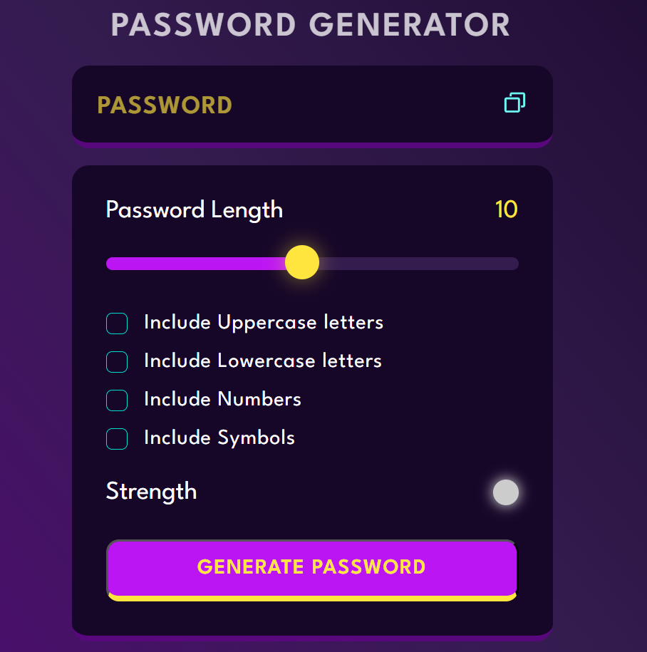

# 🔐 Password Generator

A simple, responsive **Password Generator** built with **HTML**, **CSS**, and **JavaScript**. It allows users to generate strong, customizable passwords with options for including numbers, symbols, uppercase, and lowercase letters.

---

## ✨ Features

- Generate secure random passwords
- Choose password length
- Include/exclude:
  - Uppercase letters
  - Lowercase letters
  - Numbers
  - Special characters
- Copy password to clipboard
- Responsive UI

---

## 📸 Preview

---
